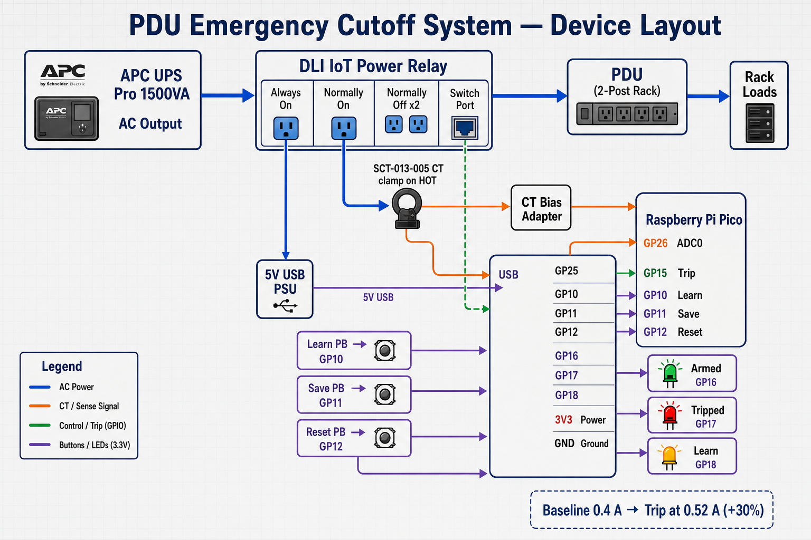

# PDU Emergency Cutoff System

Overcurrent protection for a 2-post open IT rack PDU. When PDU input current rises **30% above a learned baseline**, the system cuts AC power to the PDU via a DLI IoT Power Relay.

**Startup baseline:** 0.4 A → trip threshold = **0.52 A** (0.4 × 1.30)

## Device layout



## Hardware

| Device | Role |
|--------|------|
| APC UPS Pro 1500VA | Upstream UPS / conditioned AC source |
| SCT-013-005 clamp CT | Non-invasive PDU input current sense (5 A FS) |
| CT Bias Adapter | AC → mid-rail bias for Pico ADC |
| DLI IoT Power Relay | Controllable AC cutoff (Always On / Normally On / 2× Normally Off + switch port) |
| Raspberry Pi Pico | Sense, decide, trip, UI |
| PB switches | Learn, Save, Reset |
| LEDs | Armed, Tripped, Learn |

## Power path

```
Utility → APC UPS Pro 1500VA → DLI IoT Power Relay (Normally On outlet)
                                      ↓
                              PDU (2-post rack)
                                      ↓
                              Rack equipment
```

The SCT-013-005 clamps the **hot conductor feeding the PDU** (between DLI output and PDU input, or on the PDU cord). Pico drives the DLI **switch port** (dry contact / logic) to de-energize the Normally On receptacle on trip.

## Trip logic

1. Measure RMS current from CT → ADC.
2. Compare to stored baseline \(I_{base}\).
3. If \(I_{rms} \ge I_{base} \times 1.30\) for a debounce window → **TRIP**.
4. Trip opens the DLI Normally On path → PDU AC cutoff.
5. Latch until **Reset** (manual clear after fault investigation).

Default factory baseline: **0.4 A**. Use **Learn** + **Save** to capture a new baseline under normal load.

## Controls & indicators

| Control / LED | Function |
|---------------|----------|
| **Learn** PB | Enter learn mode; sample current for a few seconds |
| **Save** PB | Persist learned baseline to flash |
| **Reset** PB | Clear trip latch and re-arm (after current is safe) |
| **Armed** LED | Monitoring active, power path enabled |
| **Tripped** LED | Overcurrent latch active; PDU cut off |
| **Learn** LED | Learn mode active |

## Repository layout

```
docs/           Architecture, wiring, BOM, safety
firmware/       MicroPython for Raspberry Pi Pico
hardware/       Pin map, wiring notes
scripts/        Flash / serial helpers
```

## Quick start

1. Read [docs/SAFETY.md](docs/SAFETY.md) before wiring mains.
2. Wire per [docs/WIRING.md](docs/WIRING.md) and [hardware/PINMAP.md](hardware/PINMAP.md).
3. Flash firmware: see [firmware/README.md](firmware/README.md).
4. Power up → Armed LED on → press Learn under normal load → Save → verify trip threshold.

## License

MIT
